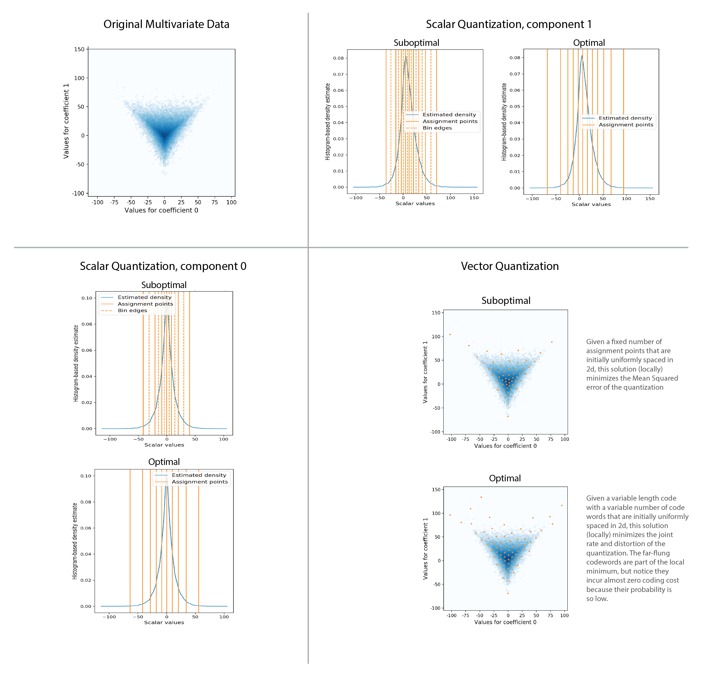
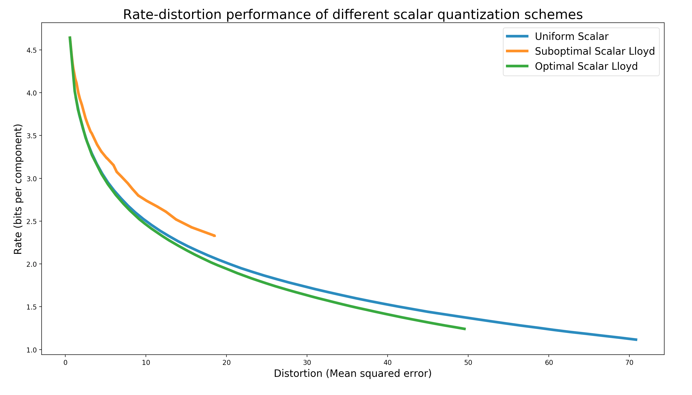
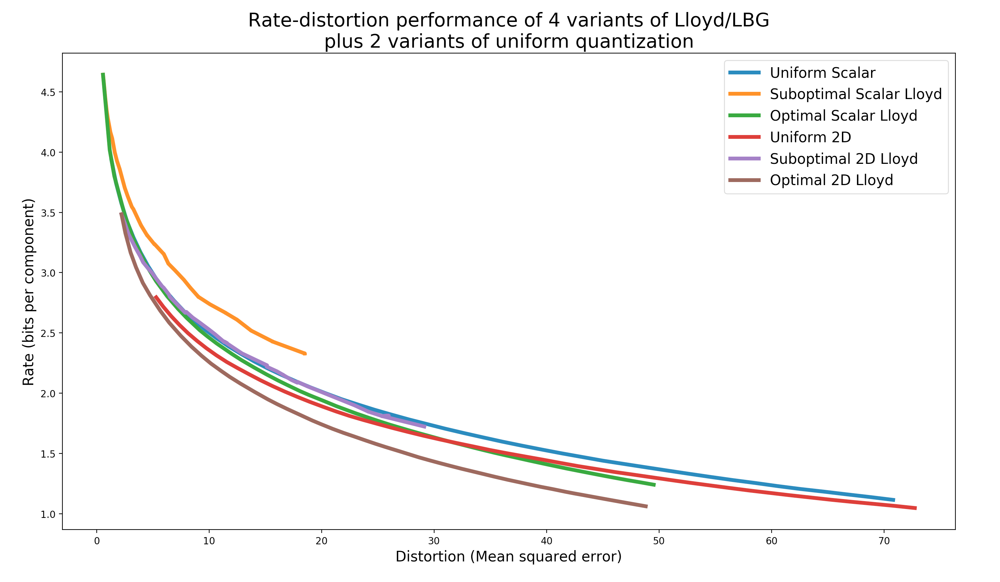

generalized-lloyd-quantization
==============================
This is a pure Python/NumPy/SciPy implementation of the Generalized Lloyd quantization scheme,
both in the most basic formulation[[1]](#ref1)[[2]](#ref1) and also in
a formulation which is optimal in terms of entropy rate[[3]](#ref1)[[4]](#ref1).
The suboptimal version is often called the Linde Buzo Gray (LBG) algorithm and the optimal
version is often called Entropy-Constrained Vector Quantization (ECVQ).

### Important considerations
1. These algorithms attempt to minimize a cost function that captures either just the mean-squared error
of the quantization or both the MSE and the entropy of the resulting code. Keep in mind that this problem
is non-convex and these algorithms only find a **local minimum** of these cost functions. In fact,
**the solution that is found may be heavily dependent on the initial locations of the assignment points**.

2. The LBG variant is only sensible when one intends to send each codeword with an equal and fixed
number of bits, a so-called 'Fixed Length Code'. If the codewords can have a variable number of bits,
a so-called 'Variable Length Code', then a lossless source code (e.g. Huffman or Arithmetic) will have an
expected code length arbitrarily close to the entropy of the quantized code. In this setting you want to
use the ECVQ variant, which will account for this entropy when making the codeword assignments.

3. In the high-fidelity regime, where there are many assignment points, the rate-distortion
benefit of using these algorithms may be minimal compared to a much simpler quantization using
uniformly-spaced assignment points. The low-fidelity regime, with very few (carefully placed) assignment points,
is where you should expect to see some benefit in using this approach.

At some point I may add an implementation in a GPU computing framework so that it can scale more
easily for vector quantization in high dimensions, but for now this is an implementation that
should still be usable for a reasonable number of dimensions.

## Dependencies
* numpy
* scipy
* matplotlib
* [hdmedians](https://github.com/daleroberts/hdmedians)

## Example
Usage can be inferred from the example found in the demo/ folder. In this particular case we
generate samples of a 2D multivariate random variable. We can either quantize each coefficient
separately or we can quantize the coefficients jointly. For this particular dataset it appears
that not only are significant gains achieved by using the entropy-rate-optimal version of the
algorithm, but that by quantizing the coefficients jointly, we also get a gain in coding
efficiency.

#### Scalar Quantization alone

#### Vector Quantization alone

#### All six variants superimposed

### Authors
Spencer Kent

### References
[<a name="ref1">1</a>]: Linde, Y., Buzo, A., & Gray, R. (1980).
An algorithm for vector quantizer design.
_IEEE transactions on information theory_, 28(1), 84-95.

[<a name="ref2">2</a>]: Lloyd, S. (1982).  Least squares quantization in PCM.  
_IEEE transactions on information theory_, 28(2), 129-137.

[<a name="ref3">3</a>]: Berger, T. (1982).
Minimum entropy quantizers and permutation codes.
_IEEE transactions on information theory_, 28(2), 149-157.

[<a name="ref3">4</a>]: Chou, P. A., Lookabaugh, T., & Gray, R. M. (1989).
Entropy-constrained vector quantization.
_IEEE transactions on acoustics, speech, and signal processing_, 37(1), 31-42.
